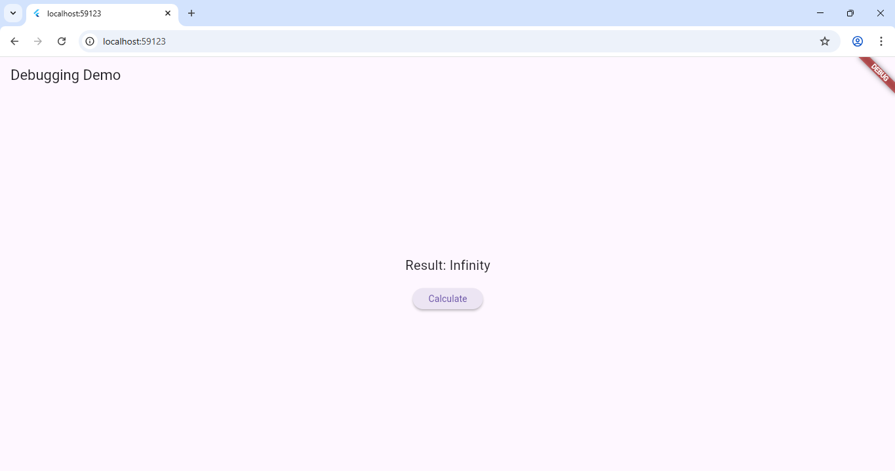

# 🐞 Experiment 10(b): Use Flutter’s Debugging Tools to Identify and Fix Issues

## 🎯 Aim
To use Flutter’s debugging tools to detect, analyze, and fix UI or logic issues.
## 🧠 Concept
Flutter provides several tools for debugging and performance analysis:
- **Flutter DevTools** → performance, widget rebuilds, memory usage
- **Hot Reload / Restart** → for instant UI refresh during development
- **print() & debugPrint()** → log messages in console
- **Flutter Inspector** → inspect UI tree and widget properties
- **breakpoints in VS Code / Android Studio** → pause execution and check variable values

## ⚙️ Procedure
1. Run the app in **debug mode**.
   ```bash
   flutter run
2. Open DevTools:
       flutter pub global activate devtools
       flutter pub global run devtools
3. Use:
   -Inspector Tab → visualize widget tree.
   -Performance Tab → track rebuilds and frame rate.
   -Logging → check print outputs.
   -Introduce an intentional bug, e.g., division by zero.
4. Use breakpoints and console logs to locate and fix it.

### Output

[](debug_output.png)