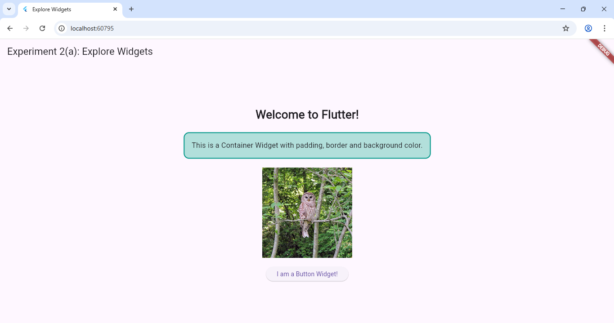

# Experiment 2(a): Explore Flutter Widgets

## Aim
To explore basic Flutter widgets like Text, Image, and Container.
## Procedure
Created a complete flutter project using Flutter create a_widgets.
Modified the lib/main.dart with the program.
## Program
// See main.dart file for complete code.

### Output:
Click the image to enlarge 👇  

