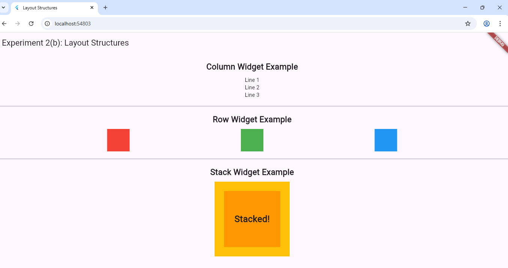

# Experiment 2(b): Layout Structures in Flutter

## Aim
To implement different layout structures using Row, Column, and Stack widgets.
## Procedure
Create a flutter project by running the command flutter create b_layout_structures.
Modify the lib/main.dart.
Run the project with command flutter run.
## Program
```dart
// Refer to main.dart file for full program.
### Output

Click the image to enlarge 👇  

[](layout_output.png)
