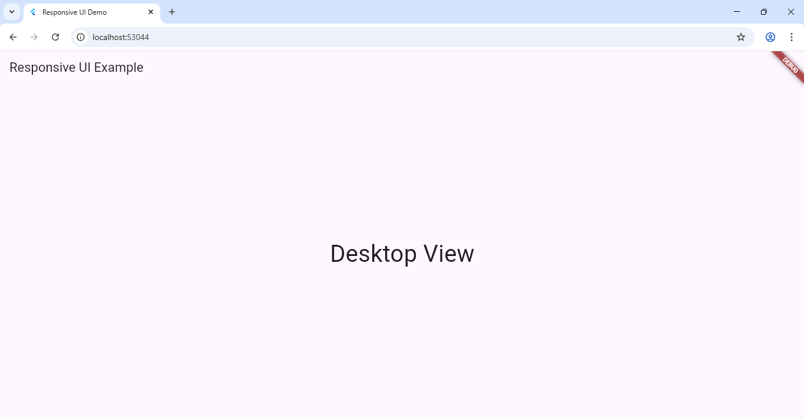
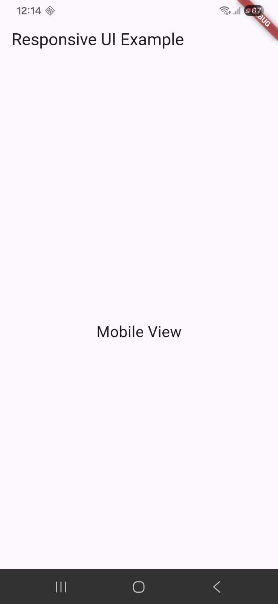

# Experiment 3(a): Responsive UI Design

## Objective
To design a user interface that adapts to different screen sizes using `LayoutBuilder`.

## Description
- Uses `LayoutBuilder` to adjust UI based on width.
- Displays “Mobile”, “Tablet”, or “Desktop” depending on the screen size.

## Output
Click image to enlarge 👇  

