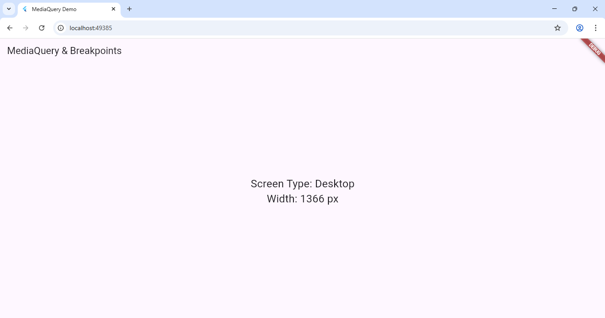

# Experiment 3(b): MediaQuery and Breakpoints

## Objective
To implement responsiveness using `MediaQuery` and custom breakpoints.

## Description
- Detects screen width using `MediaQuery`.
- Categorizes device as Mobile, Tablet, or Desktop dynamically.

## Output
Click image to enlarge 👇  

