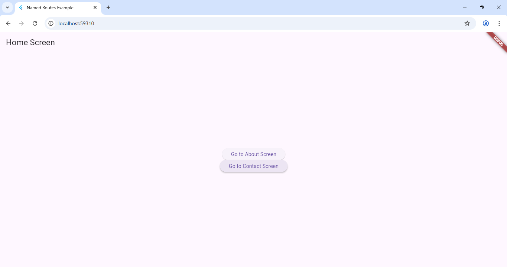

# Experiment 4(b): Navigation Using Named Routes

## Objective
To implement screen navigation using named routes.

## Description
- Defined routes in `MaterialApp`.
- Used `Navigator.pushNamed()` and `Navigator.pop()` for transitions.

## Output
Click image to enlarge 👇  

