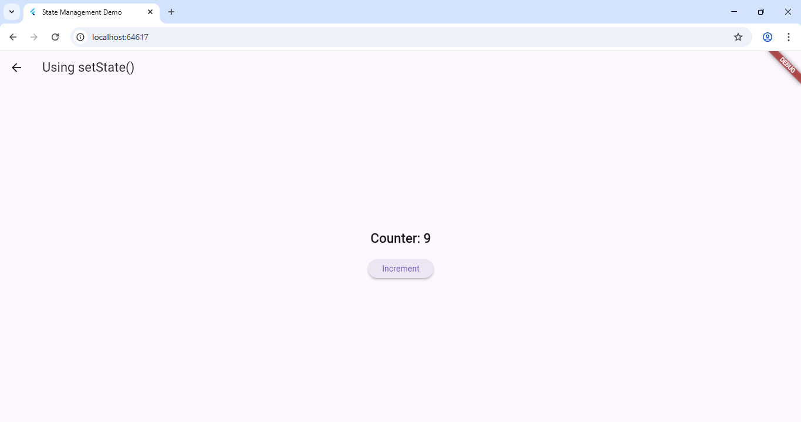
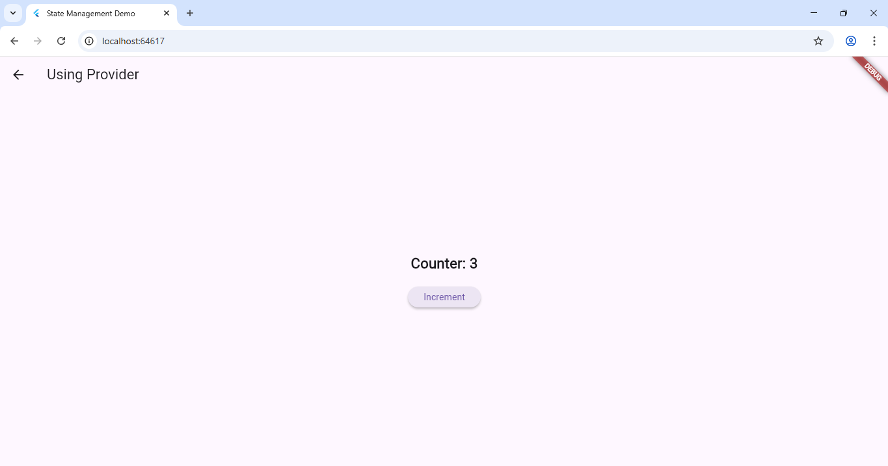

# Experiment 5(b): Implement State Management using `setState()` and `Provider`

## 🎯 Objective
To understand how to manage and update the state of widgets using **setState()** (local state) and **Provider** (app-wide state).

---

## 🧠 Theory

Flutter provides multiple ways to manage state.  
Two common approaches are:

1. **setState()** – used for small, local UI updates within a single widget.
2. **Provider** – used for managing state across multiple widgets efficiently.

### Output 

