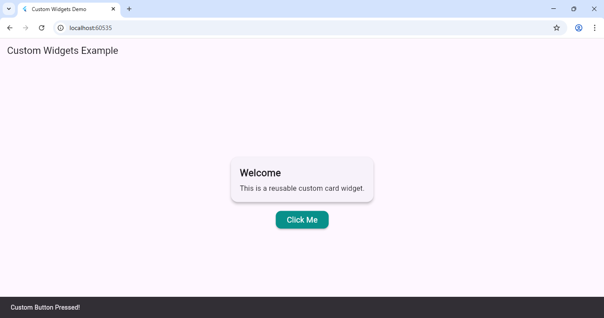

# Experiment 6(a): Create Custom Widgets for Specific UI Elements

## 🎯 Objective
To learn how to create **custom reusable widgets** for specific UI components like buttons and cards in Flutter.

---

## 🧠 Theory
Flutter allows you to create **custom widgets** to encapsulate design and logic, making your UI reusable and maintainable.  
Custom widgets can be **Stateless** (static design) or **Stateful** (interactive elements).

### Output

