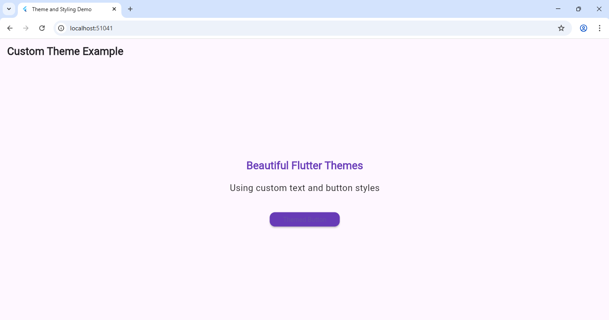

---

## 🧩 **Experiment 6(b): Apply Styling Using Themes and Custom Styles**

📄 Save this as  
`Experiment-6/b_themes_and_styles/readme.md`

# Experiment 6(b): Apply Styling Using Themes and Custom Styles

## 🎯 Objective
To apply **global themes** and **custom styles** in Flutter using `ThemeData`, making the app consistent and visually appealing.

---

## 🧠 Theory
Flutter provides a powerful **theming system** using `ThemeData` that allows developers to:
- Set global colors, text styles, and button appearances.
- Maintain consistent UI across all screens.
- Easily update app-wide design with minimal code.
---
 ### Output

 
