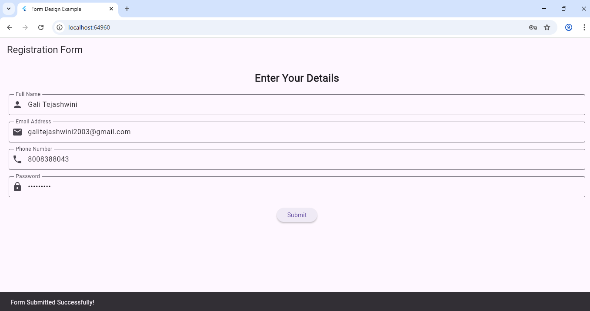

# Experiment 7(a): Design a Form with Various Input Fields

## 🎯 Objective
To design a **user input form** with multiple text fields in Flutter such as Name, Email, Phone, and Password using `TextFormField`.

---

## 🧠 Theory
In Flutter, forms are created using:
- `Form` widget → wraps input fields for validation and submission.  
- `TextFormField` → accepts user input and supports validation.  
- `TextEditingController` → manages text field values.

---
### Output 

