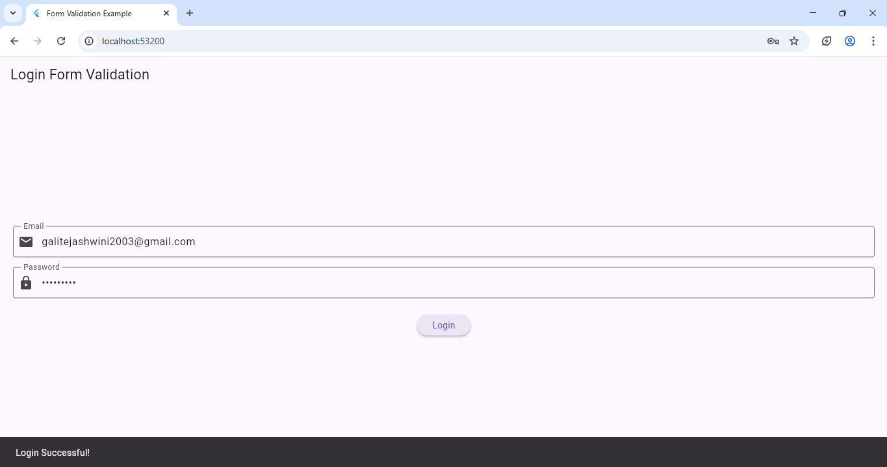

# Experiment 7(b): Implement Form Validation and Error Handling

## 🎯 Objective
To implement **form validation** and display **error messages** when input fields are invalid or left empty.

---

## 🧠 Theory
Flutter provides form validation using:
- `Form` widget and `GlobalKey<FormState>` for validation state.  
- `validator:` property inside each `TextFormField`.  
- `formKey.currentState!.validate()` to check if all fields are valid.

---
### Output

