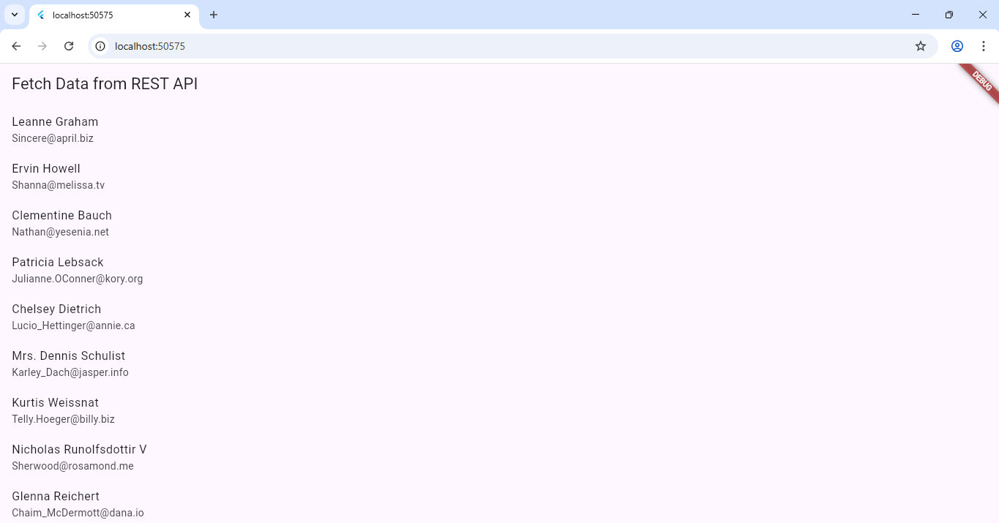

# 🌐 Experiment 9(a): Fetch Data from a REST API

## 🎯 Aim
To learn how to fetch data from a REST API in a Flutter application using the `http` package.

## 🧠 Concept
- The `http` package is used in Flutter to make HTTP requests (GET, POST, etc.).
- Data fetched from an API is usually in JSON format.
- The `Future` and `async/await` keywords are used to handle asynchronous data.

## ⚙️ Procedure
1. Create a new Flutter project.
   ```bash
   flutter create fetch_data_api
   cd fetch_data_api
2. Open pubspec.yaml and add:
     dependencies:
     http: ^1.2.0
3. Run flutter pub get anf then flutter run.

### Output

[](fetch_api_output.png)