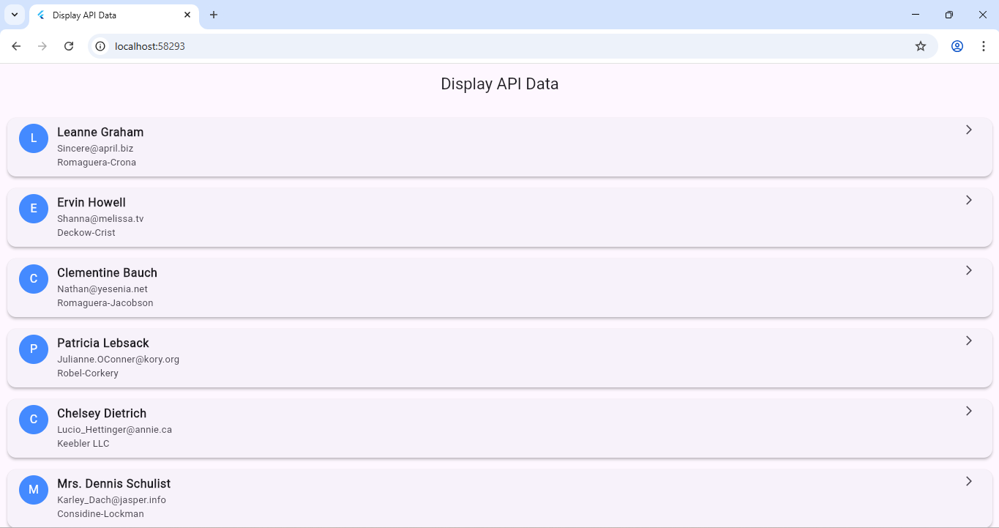

# 🧩 Experiment 9(b): Display the Fetched Data in a Meaningful Way in the UI

## 🎯 Aim
To display fetched API data using structured Flutter UI elements such as Cards and ListTiles.

## 🧠 Concept
Displaying API data meaningfully improves user readability and interaction.  
Commonly used widgets:
- `ListView.builder`
- `Card`
- `ListTile`
- `CircleAvatar`

## ⚙️ Procedure
1. Continue from the previous experiment or copy the project.
2. Use widgets like `Card` and `ListTile` for better UI formatting.
3. Display name, email, and company info in a clean, styled layout.

### Output

